# 基于视觉的手势识别交互系统
这里保存我的本科毕业论文

---

### 1 系统效果展示
为了不浪费大家时间，本小节将会展示我的系统效果，如果大家觉得做的还可以再往后看；哈哈哈，如果哪里有错误，还望您能不吝赐教，感谢您的观看。
本系统能完成绘画、娱乐等图像界面控制功能。

本系统能完成绘画、娱乐等图像界面控制功能。

手势绘图_画五角星

手势娱乐_水果忍者

手势图像界面操作_打开我的毕业论文

---

### 2 系统整体展示
基于视觉的手势识别系统流程图

---

### 3 细节说明

首先,我们需要检查肤色区域

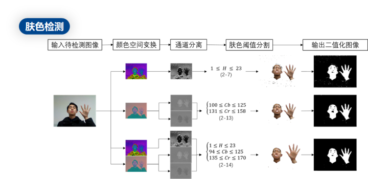

这是我们的样本集

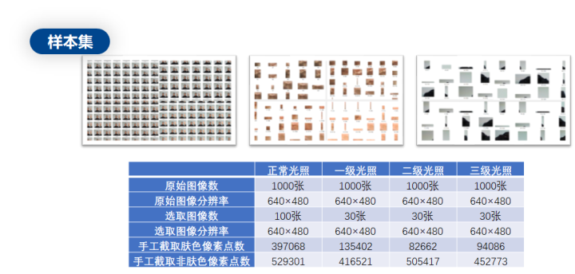

样本集特征处理

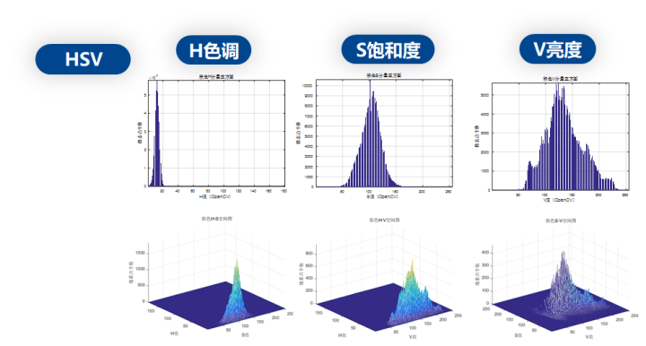

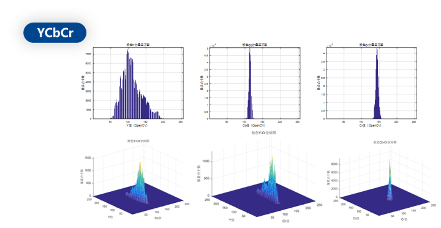

肤色检测完成

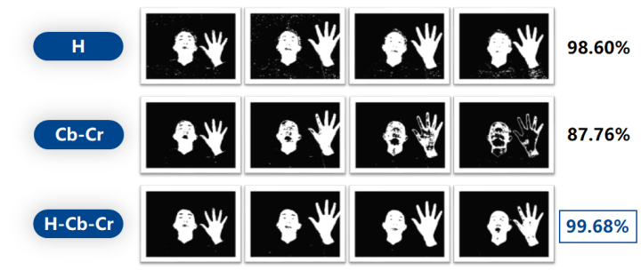

开始获取连通的肤色区域

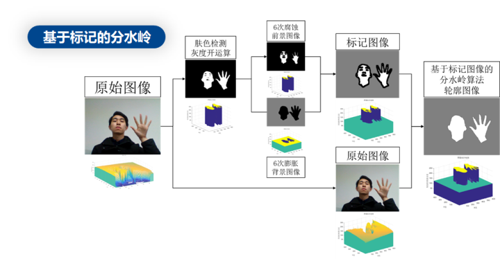

分水岭肤色分割

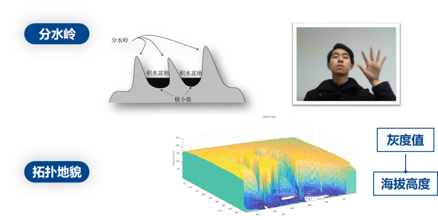

获得了联通的肤色区域

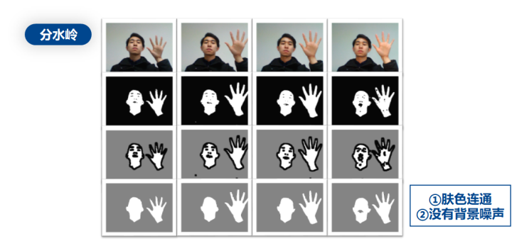

使用种子填充算法获得肤色连通区域

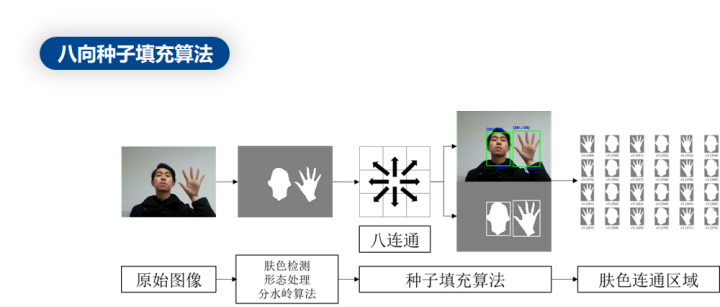

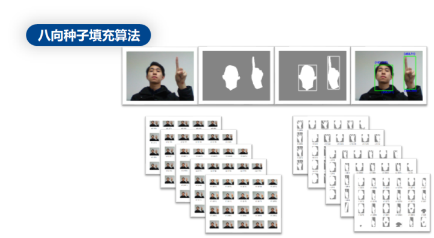

下面开始手势跟踪

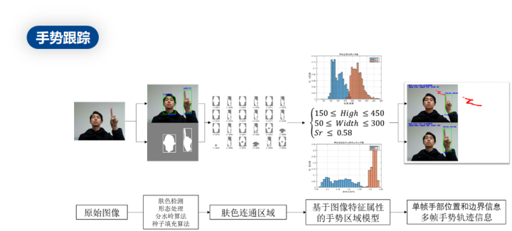

手部和脸部的肤色比例明显不同

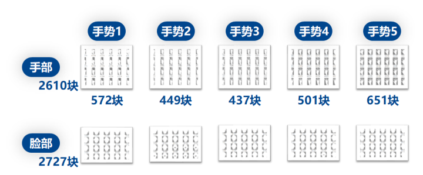
